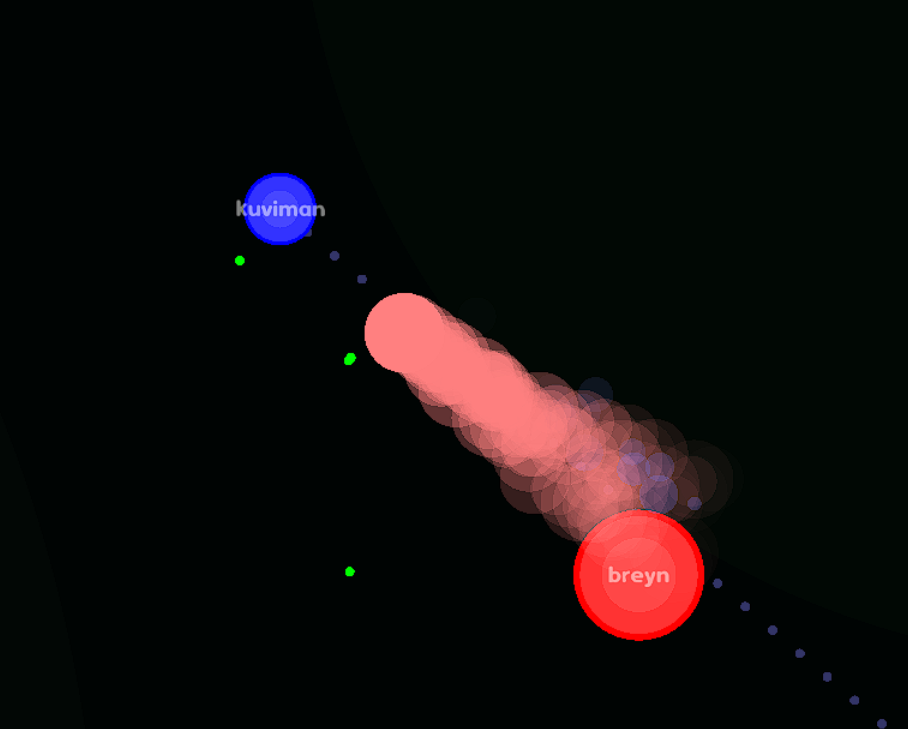

# lifeshot.io (WIP)

## Play

You can play the game on <https://lifeshot.io.kuviman.com>



## Build

Install [Rust](https://rust-lang.org), then, run local server and connect to it with:

```shell
cargo run --release -- with-server
```

To build web version, `cargo-web` is needed:

```shell
cargo install cargo-web
cargo web start --release --open
```

Web version can not start server, to it will be needed to be started separately:

```shell
cargo run --release -- server-only
```
